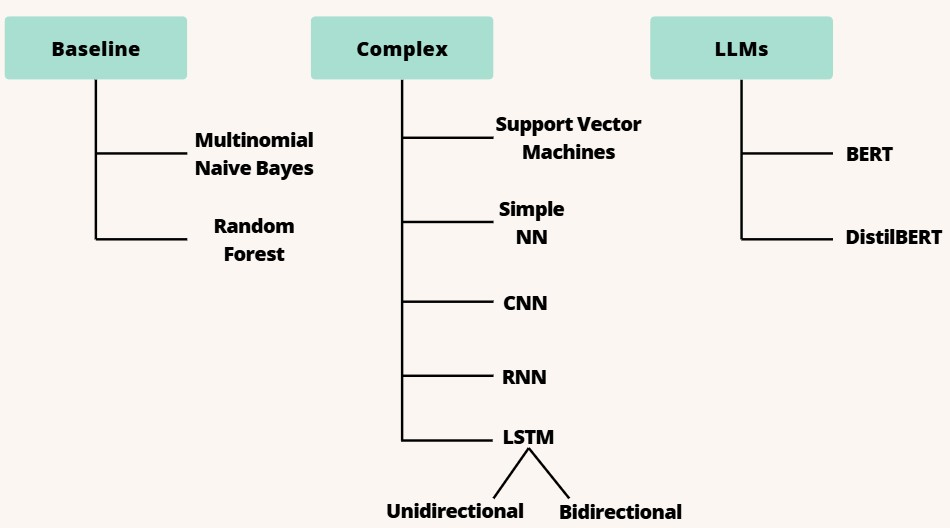

# From Detection to Credibility: A Machine Learning Framework for Assessing News Source Reliability

## Project Overview

This project focuses on assessing the credibility of US news sources by analyzing their articles and determining whether the content is real or fake. Using natural language processing (NLP) techniques and machine learning algorithms, the project assigns a credibility score to different news websites and ranks them based on this score.

### Objectives:

- Utilise a myriad of classification models to determine the best performing model.
- Scrape news articles from various US websites.
- Use NLP techniques to analyze and classify news as real or fake.
- Assign credibility scores to news sources based on classification results.
- Rank news sources by credibility for better public information access.

### Overview of Models:



---

## Table of Contents

1. [Project Setup](#project-setup)
2. [Installation](#installation)
3. [Dataset](#dataset)
4. [Data Collection](#data-collection)
5. [Scraped Data](#scraped-data)
6. [Description of Notebooks](#description-of-notebooks)
7. [Contributors](#contributors)

---

## Project Setup

Before running the project, ensure you have the required libraries installed. The project is based on Python and utilizes several NLP and machine learning libraries.

---

## Installation

To set up the environment, follow these steps:

1.  Clone the repository:

        git clone https://github.com/shaunzzhou/DM-Fake-News-Detection.git

2.  Navigate to the project directory:

        cd DM-Fake-News-Detection

3.  Create a virtual environment:

        python -m venv venv

    source venv/bin/activate # For Linux/macOS
    venv\Scripts\activate # For Windows

4.  Install the required dependencies:
        
```
# Install deps
pip install -r requirements.txt

# To use CUDA, run following commands
# Install tensorflow with CUDA
pip install tensorflow[and-cuda]

# Install RAPIDS
pip install \
    --extra-index-url=https://pypi.nvidia.com \
    "cudf-cu12==25.2.*" "dask-cudf-cu12==25.2.*" "cuml-cu12==25.2.*" \
    "cugraph-cu12==25.2.*" "nx-cugraph-cu12==25.2.*" "cuspatial-cu12==25.2.*" \
    "cuproj-cu12==25.2.*" "cuxfilter-cu12==25.2.*" "cucim-cu12==25.2.*" \
    "pylibraft-cu12==25.2.*" "raft-dask-cu12==25.2.*" "cuvs-cu12==25.2.*" \
    "nx-cugraph-cu12==25.2.*"
```

The requirements.txt file includes the following packages:

- pandas
- numpy
- scipy
- tqdm
- matplotlib
- seaborn
- langdetect
- langid
- nltk
- spacy
- wordcloud
- scikit-learn
- tensorflow
- torch
- transformers
- tokenizers
- keras
- gensim

---

## Dataset

The project uses a labelled dataset of real and fake news articles, which can be downloaded from Kaggle. This dataset provides the foundational data for training the models.

- **Dataset link:** [Kaggle: WELFake Fake News Classification Dataset](https://www.kaggle.com/datasets/saurabhshahane/fake-news-classification)

Brief Description of `csv` files:

- Original csv file is split into 3 csv files (`part1.csv`, `part2.csv`, `part3.csv`) so that each csv file is small enough to be pushed to GitHub.
- `processed_data.csv` contains all 3 csv parts combined and basic preprocessing has been done such as tokenization and stemming which can be found in `stemming.ipynb`, this csv file is subsequently used in the `model_experiments` folder.

## Data Collection

This project uses news articles scraped from various sources, including reliable and unreliable websites. The structure of the dataset is as follows:

- `index`: index of article
- `title`: The title of the article.
- `text`: The main text of the article.
- `label`: 1 for fake news, 0 for real news.

## Scraped Data

10 news media outlet websites have been scraped: 5 from known reliable sites and 5 from known questionable sites. Since our project focuses on classifying political news, all articles were scraped from the Politics/Elections/Congress sections of each news site to ensure relevance to the US political landscape.

**Reliable Sites:**

- CNN
- NPR
- BBC
- The Guardian
- AP

**Questionable Sites:**

- Breitbart
- The Daily Caller
- Newsmax
- Natural News
- ZeroHedge

---

## Description of notebooks

── model_experiments<br>
│ ├── `BERT.ipynb` <br>
│ ├── `CNN.ipynb`<br>
│ ├── `DistilBERT.ipynb`<br>
│ ├── `LSTM.ipynb`<br>
│ ├── `RNN.ipynb`<br>
│ ├── `SimpleNN.ipynb`<br>
│ ├── `SVM.ipynb`<br>
├── processing_experiments<br>
│ ├── `booster_words.ipynb` Booster words with CountVectorizer to baseline models<br>
│ ├── `count_vectoriser.ipynb` CountVectorizer to baseline models<br>
│ ├── `lemmatisation.ipynb` Lemmatisation to baseline models<br>
│ ├── `stemming.ipynb` Porter Stemmer to baseline models<br>
├── web_scraping<br>
│ ├── `scraped_data_preprocessing.ipynb` Applied our best model (CNN) to scraped data<br>
├── `EDA.ipynb` Initial EDA

---

## Contributors

This project was developed by:

- Shaun Zhou
  [GitHub](https://github.com/shaunzzhou)
- Darius Ng
  [GitHub](https://github.com/dariusnggg)
- Gabriel Chua
  [GitHub](https://github.com/deseyebags)
- Ryan Lee
  [GitHub](https://github.com/ryan99324)
- Abhay
  [GitHub](https://github.com/Helliad)
- Sakthivel
  [GitHub](https://github.com/sakthivelg2022)
- See Jae
  [GitHub](https://github.com/seejaee)

---
